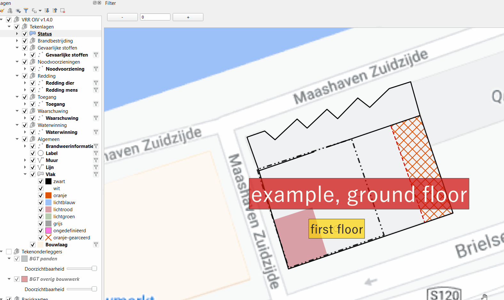
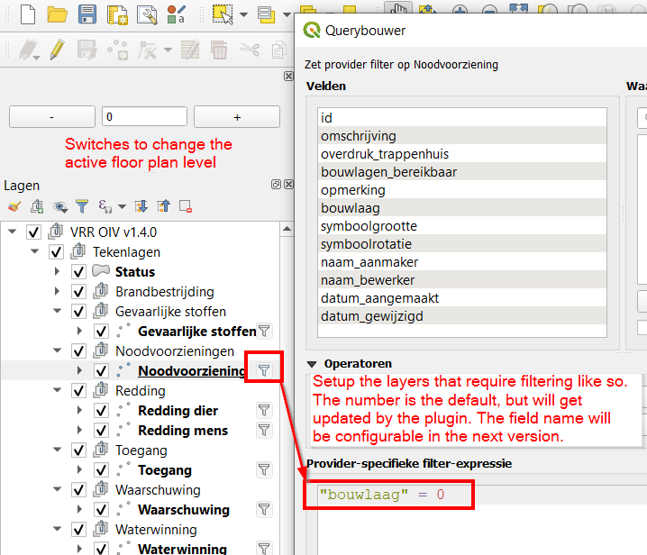

# floor-plan-filter

A QGIS plugin to filter content based on the active floor plan level.

## Setup

1. Setup query filters on the layers that need to be filtered.

2. The plugin will update the value of the filter in order to display different data according to the active floor plan level.

*Note: the field name for filtering will be configurable in the next version.*

